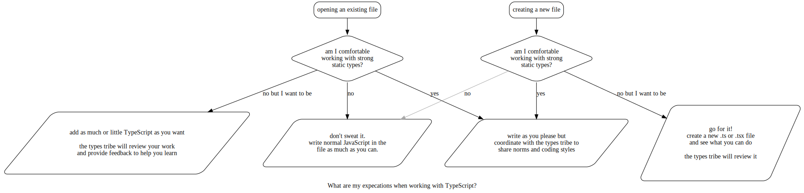

TypeScript Coding Guidelines
============================

Although TypeScript exists inside of the Calypso repository you don't currently need to feel obligated to use it.
We have brought it in for added safety and automation while developing our software and thus an operating principle
is that the type system is supposed to serve you; if you feel like you are serving the type system then consider
stepping back to normal JavaScript or raise a discussion in Slack.

## Should I be using TypeScript?

Try to follow this flow-chart to see if you should be using TypeScript in your work.

If you have come here to ask this question then you should feel comfortable continuing to use JavaScript
as you have been doing and you don't need to change your workflow.

If you are jumping into a file that is already written in TypeScript then it gets slightly more complicated
because you might be working in code that is unfamiliar to you. Try your best to work within that code but
don't feel compelled to match its use of types and type annotations. We have created the `@Automattic/type-review`
team in Calypso to monitor and review all work being done in TypeScript files as we grow together to establish
norms and learn proper patterns and idioms; this team is there to help guide you in the unfamiliar territory. 

Graph built with [`typescript-dev-flow.dot`](./typescript-dev-flow.dot)

## Type Principles for Calypso

 - TypeScript has a modern type system unlike those from the C language or Java. It's _permissive_ in the sense
   that we can add types to part of a file without typing the entire file and in the sense that it's _structural_
   instead of _nominative_ meaning that it tries to unify type constraints whether they are specified as a `Person`
   or as "an object containing a `string` property called `name`." We will allow its design to inform our use patterns.
 - _Type only what is helpful_: TypeScript's inference engine is powerful and can usually infer type information
   from untyped JavaScript. Encode only as much in the annotation as is necessary to clear up ambiguities in the
   inferred types and also to communicate to other developers.
